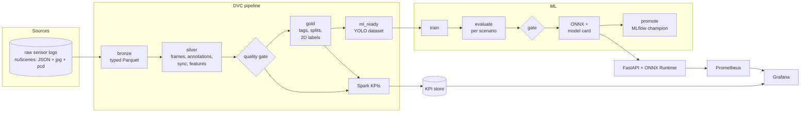

# Architecture and design decisions

## Layers

- **raw** is read-only and versioned by DVC. Nothing ever writes into it; bad data is flagged,
  not "fixed" in place.
- **bronze** is a 1:1 typed copy of the source metadata, so every later layer can be rebuilt
  without touching the raw release.
- **silver** is one row per sensor frame. This is the table every question about the data starts
  from (how much, how good, how synchronised).
- **gold** is the curated view: which samples are usable, in which split, under which scenario.
- **ml_ready** is framework-specific (YOLO today). Only this layer changes if the model changes.

## Decisions

**DVC for data + pipeline, MLflow for experiments.** DVC answers "which data, code and params
produced this file" and restores it; MLflow answers "which run was best and what is in production".
Both carry the same identifiers (git commit, DVC hash of `data/ml_ready`), so one can be joined
to the other.

**Every stage is a CLI command.** `avdata <stage>` runs the same way from DVC, Airflow (Bash or
Kubernetes pod), CI, a Kaggle kernel or a laptop. The orchestrator decides *when and where*, the
code decides *what*.

**Airflow tasks call `dvc repro --single-item <stage>`.** Airflow gets per-stage retries, logs
and alerting; DVC keeps the lineage record and skips unchanged work. Neither duplicates the other.

**Sensor registry instead of per-sensor code.** Ingestion, decoding, rate checks, sync checks and
KPIs are generic over channels; a modality only defines how to decode a file and which features to
compute. Adding radar or another camera is configuration.

**Quality checks produce data, not just pass/fail.** Every issue is a row (check, severity,
entity, value, message). ERRORs stop the pipeline; WARNs become KPIs and per-frame flags that
curation uses to decide ML readiness. The same rows feed Grafana.

**Scene-level splits.** Frames from one recording are highly correlated; splitting by frame leaks
test data into training. Splits are by scene, stratified by time of day, and verified by a check.

**Regression set.** Hard cases (night, rain, bicycles, crowded scenes) in the test split form a
fixed set every candidate model is gated on, so an average improvement cannot hide a regression
where it matters.

**Spark where it pays.** Decoding every file and aggregating KPIs are embarrassingly parallel and
grow with the fleet; both have a Spark path. Small metadata joins stay in pandas, where they are
faster on one machine.

## Scaling path

| Now (mini) | Next | Then |
|---|---|---|
| 10 scenes, 2 channels | full trainval (850 scenes), 6 cameras + LiDAR + radar | fleet recordings (rosbag/MCAP ingestion) |
| pandas + local Spark | Spark on a cluster (`SPARK_MASTER`), Parquet partitioned by scene/date | Delta/Iceberg tables for incremental upserts |
| files copied into `ml_ready` | WebDataset shards streamed from object storage | feature store for shared features |
| Airflow standalone | Airflow on Kubernetes, tasks as pods | per-sensor DAGs, backfills by date |
| Colab/Kaggle GPU | Slurm or Kubernetes GPU nodes | distributed training (DDP) |
